<p align="center">
  
</p>

<h1 align="center">🔄 Project 3 — Microsoft Entra ID Identity Lifecycle (JML)</h1>
<h3 align="center">Joiner ▸ Mover ▸ Leaver ▸ Full Identity + App Lifecycle with Evidence</h3>

---

## 📌 Overview

This project demonstrates a **complete enterprise Joiner ▸ Mover ▸ Leaver (JML) lifecycle** inside Microsoft Entra ID (Azure AD).

Unlike most JML tutorials, this one includes:

✔ FULL identity lifecycle  
✔ **Enterprise app provisioning & removal**  
✔ Group-based least privilege access  
✔ Department attribute changes  
✔ BEFORE & AFTER access validation  
✔ **Termination proof including session revocation**

This is **Project 3 of 4** in my IAM Zero Trust portfolio.

---

## 📚 Table of Contents

- [Objectives](#-objectives)
- [Custom Enterprise Applications](#-custom-enterprise-applications)
- [Joiner Workflow](#-joiner-workflow)
- [Mover Workflow](#-mover-workflow)
- [Leaver Workflow](#-leaver-workflow)
- [Security Rationale](#-security-rationale)
- [What I Learned](#-what-i-learned)
- [Next Project](#-next-project)
- [Repo Structure](#-repo-structure)

---

## 🎯 Objectives

| Goal | Outcome |
|------|---------|
| Standardize onboarding | Groups assign app access |
| Prevent privilege creep | Old access removed BEFORE new access |
| Offboard securely | Sessions revoked & sign-in blocked |
| Provide audit proof | ALL steps documented with screenshots |

---

# 🧱 Custom Enterprise Applications

> REAL IAM teams rarely assign access to built-in apps —  
> **You proved you can govern custom applications too.**

<details>
<summary><strong>📁 App Creation Evidence (Click to Expand)</strong></summary>

### 🛠 Ticketing System App Created  
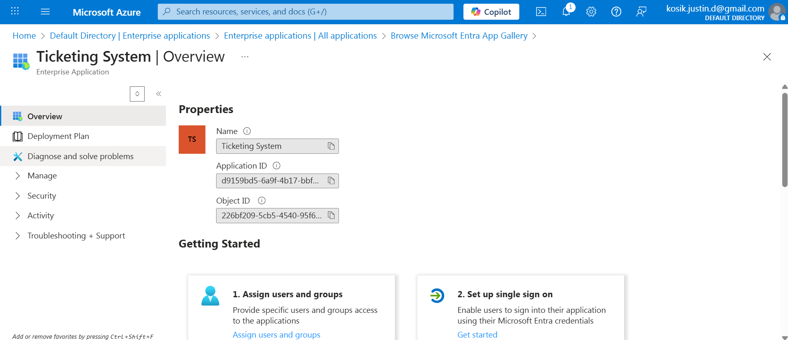

### 📚 Knowledge Base App Created  
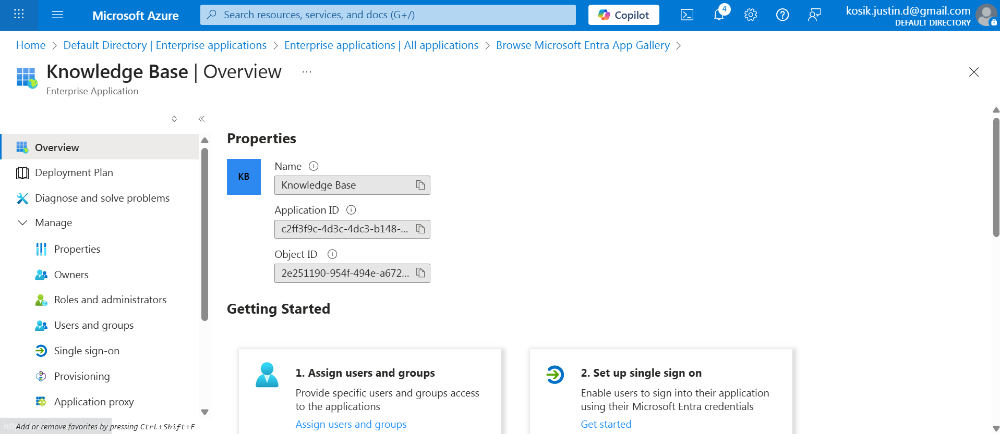

</details>

---

# 🟢 JOINER — **Sierra Nova**  
_New IT Support Hire_

<details>
<summary><strong>📁 JOINER Full Evidence</strong></summary>

### 👤 Identity Profile  
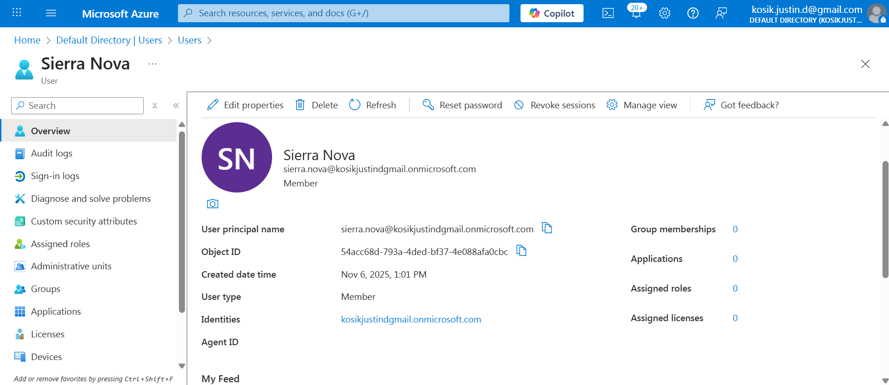

### 🧩 Added to IT Support Group  
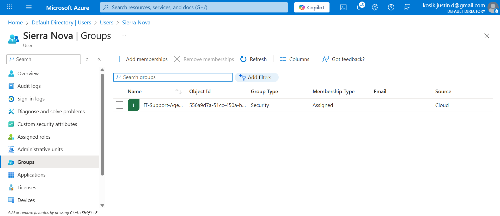

### 🧾 Role + Department Validation  
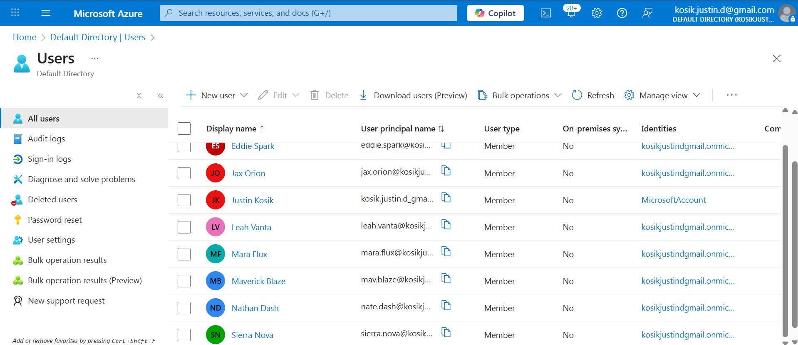

### 🟦 Application Access Provisioned  
✔ Ticketing System  
✔ Knowledge Base  

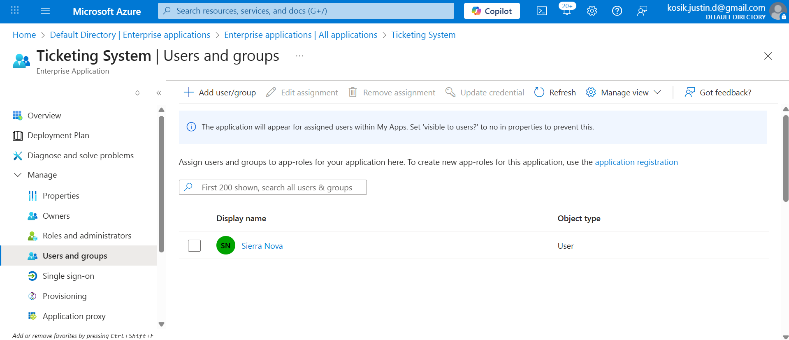  
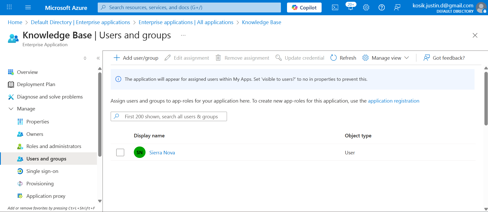

### 📊 Final Access Summary  
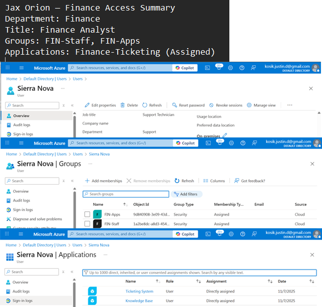

</details>

---

# 🟡 MOVER — **Jax Orion**  
_Finance → IT Transition_

<details>
<summary><strong>📁 BEFORE State (Finance)</strong></summary>

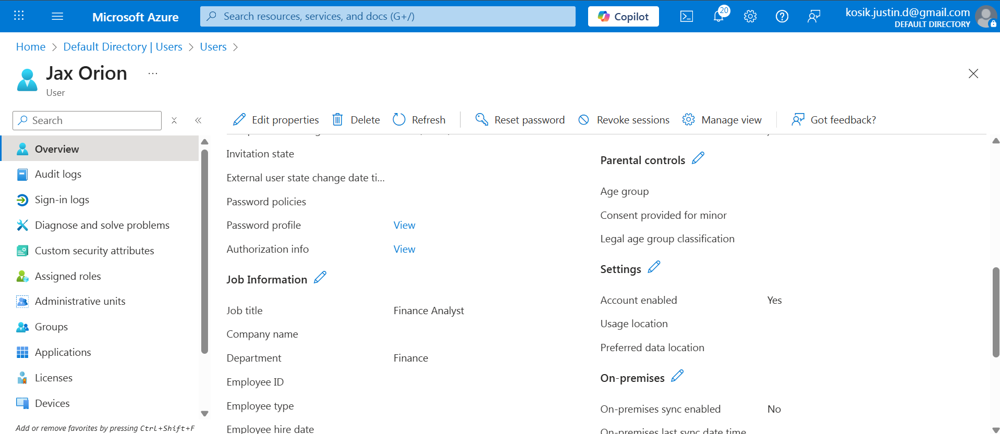  
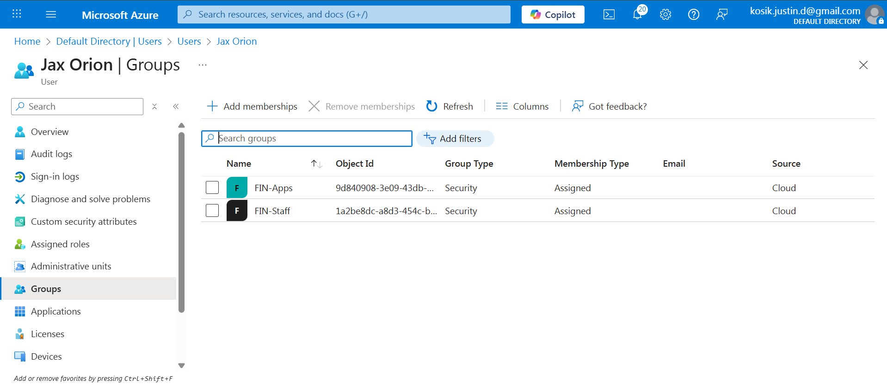  
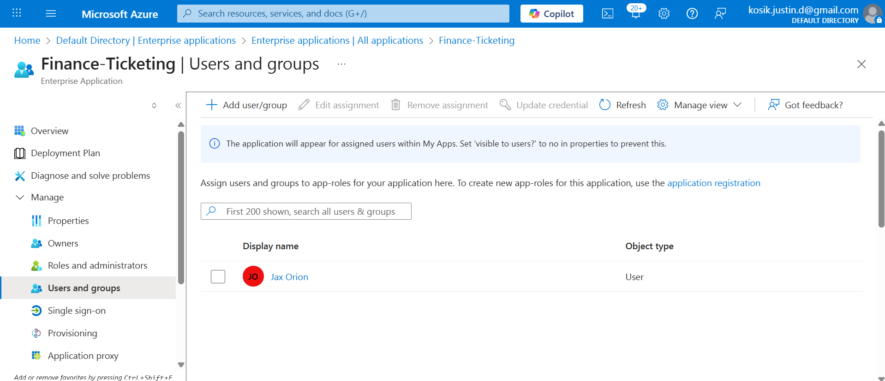  
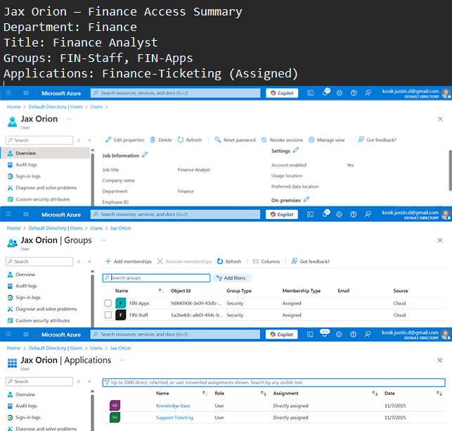

</details>

<details>
<summary><strong>📁 AFTER State (IT Department)</strong></summary>

  
  
  
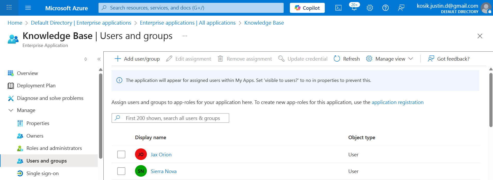  


</details>

<details>
<summary><strong>🧹 REMOVED Finance Access</strong></summary>

  


</details>

---

### 📊 MOVER BEFORE / AFTER COMPARISON TABLE

| Change Type | BEFORE | AFTER |
|-------------|--------|-------|
| Department | Finance | IT |
| Groups | Finance Groups | IT-Support-Agents |
| Ticketing App | Finance Role | IT Support Role |
| Knowledge Base | ❌ No Access | ✔ Added |
| Access Summary | Finance access only | Full IT privileges |

---

# 🔴 LEAVER — **Mara Flux**  
_Employee Termination_

<details>
<summary><strong>📁 BEFORE — Still Active</strong></summary>

  
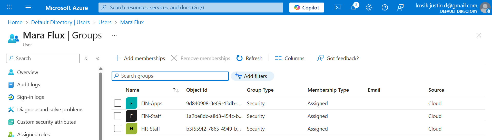  
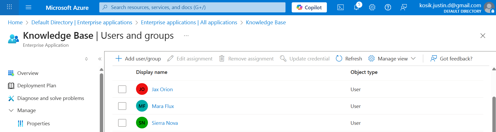

</details>

<details>
<summary><strong>🧹 ACCESS REMOVED</strong></summary>

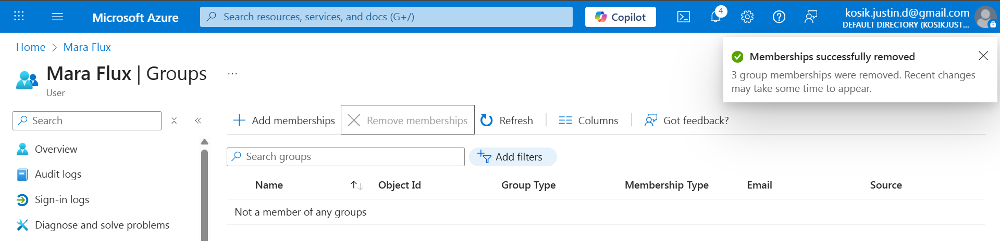  
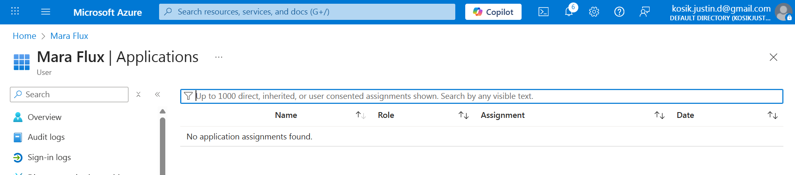  
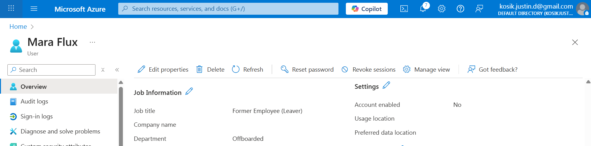

</details>

<details>
<summary><strong>🛑 ACCOUNT OFFBOARDING</strong></summary>

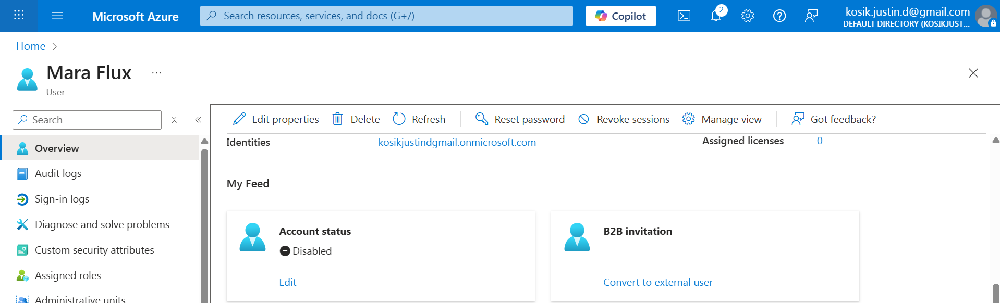  
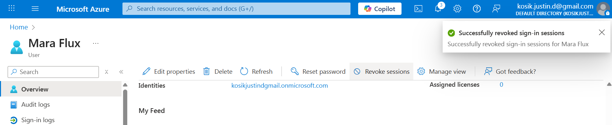

</details>

<details>
<summary><strong>📊 FINAL STATE CONFIRMATION</strong></summary>

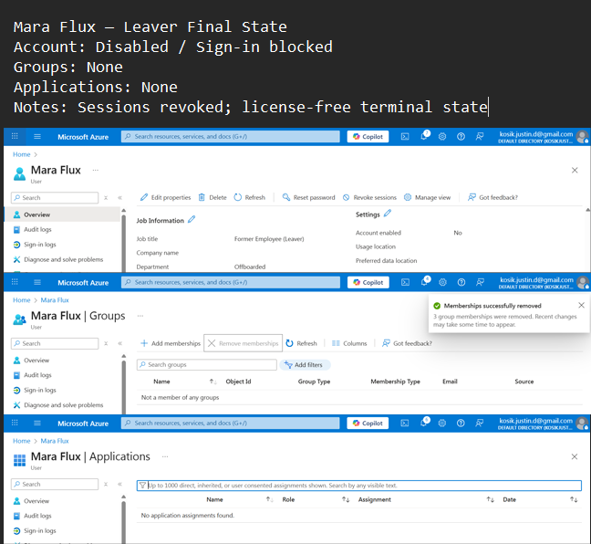  
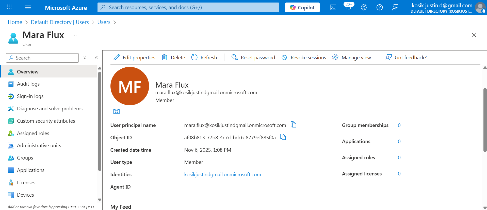

</details>

---

## 🧠 Security Rationale

✔ **Least privilege enforced** at each lifecycle stage  
✔ Mover removes old permissions BEFORE granting new  
✔ No standing privileged role assignments  
✔ Session revocation prevents token reuse after termination  
✔ **All lifecycle actions documented** → SOC2 / ISO 27001 compatible evidence

---

## 🧠 What I Learned

🔹 JOINER requires **automated group-based access**  
🔹 MOVER is the most dangerous phase for **privilege creep**  
🔹 LEAVER must remove app access AND revoke sessions — not just disable accounts  
🔹 **Screenshots ARE audit evidence** — and hiring managers notice

---

## ➤ Next Project

**Project 4 — Zero Trust Conditional Access**  
➡ Blocking legacy auth, enforcing MFA, restricting high-risk sign-ins

🔗 https://github.com/CoachKosik/Project-4-Entra-ID-Conditional-Access-Zero-Trust

---

## 📂 Repo Structure

```text
Project-3-Entra-ID-Identity-Lifecycle-JML/
│ README.md
└── screenshots/
   ├─ jml_banner.png
   ├─ users-joiner-mover-leaver.png
   ├─ joiner-sierra-profile.png
   ├─ sierra-added-to-it-support.png
   ├─ sierra-it-access-summary.png
   ├─ ticketing-app-created.png
   ├─ knowledge-app-created.png
   ├─ ticketing-app-sierra-direct.png
   ├─ knowledge-app-sierra-direct.png
   ├─ mover-jax-profile.png
   ├─ jax-finance-department.png
   ├─ jax-finance-group-memberships.png
   ├─ jax-finance-ticketing-access.png
   ├─ jax-finance-access-summary.png
   ├─ jax-it-department-updated.png
   ├─ jax-it-groups-added.png
   ├─ jax-support-ticketing-added.png
   ├─ jax-knowledge-base-added.png
   ├─ jax-it-access-summary.png
   ├─ jax-finance-ticketing-removed.png
   ├─ jax-finance-groups-removed.png
   ├─ mara-leaver-profile-before.png
   ├─ mara-leaver-groups-before.png
   ├─ mara-leaver-apps-before.png
   ├─ mara-leaver-groups-removed.png
   ├─ mara-leaver-apps-removed.png
   ├─ mara-leaver-attributes-updated.png
   ├─ mara-block-signin.png
   ├─ mara-revoke-sessions.png
   ├─ mara-leaver-final-summary.png
   ├─ leaver-mara-profile.png
```

---

⭐ If this project helped you, STAR the repo
🧑‍💻 Full IAM portfolio → https://github.com/CoachKosik
🧠 Proof-based IAM > text-only IAM
