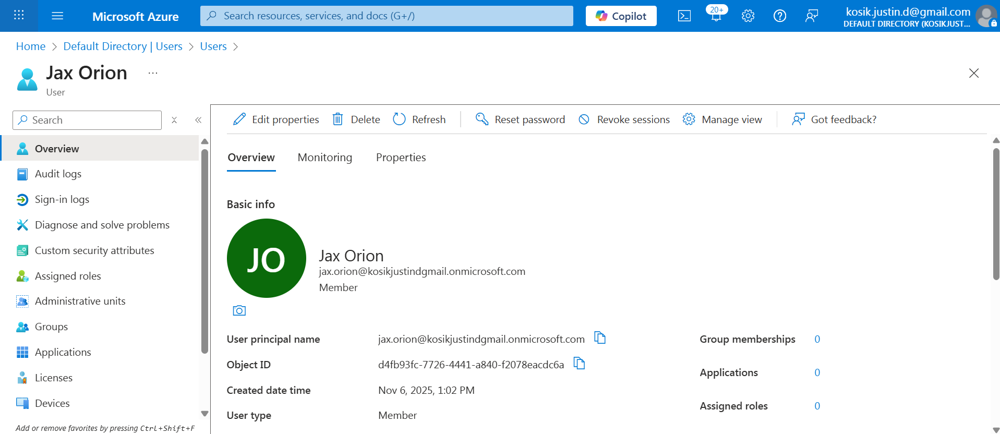
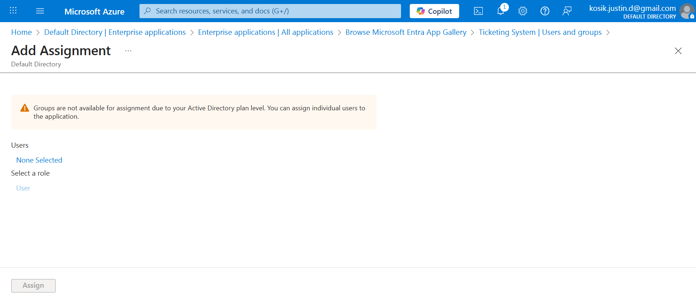
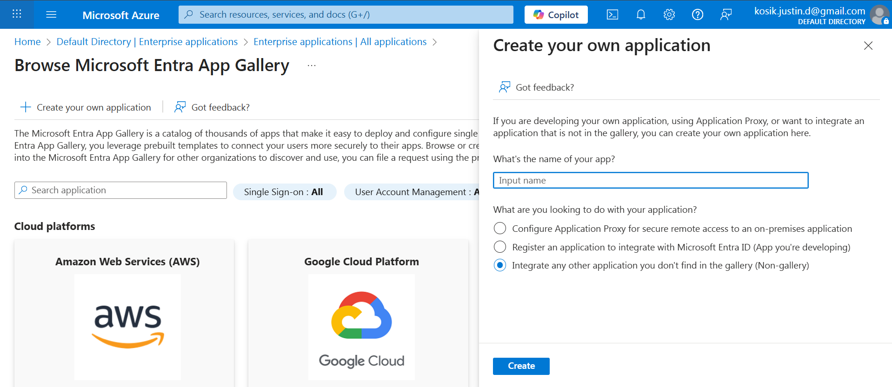

<p align="center">
  
</p>

# 🔄 Project 3 — Entra ID (Azure AD) Identity Lifecycle (JML)
_Joiner → Mover → Leaver_


---

<details>
  <summary><b>📚 Table of Contents</b></summary>

- [Objective](#-objective)
- [Identity Architecture & Naming](#-identity-architecture--naming)
- [PART 1 — Joiner: Sierra Nova (IT Support)](#-part-1--joiner-sierra-nova-it-support)
- [PART 2 — Mover (BEFORE): Jax Orion in Finance](#-part-2--mover-before-jax-orion-in-finance)
- [Evidence & Screenshots (Audit Artifacts)](#-evidence--screenshots-audit-artifacts)
- [Licensing Note](#-licensing-note)
- [What’s Next](#-whats-next)
- [Repo Structure](#-repo-structure)

</details>

---

## 🎯 Objective
Demonstrate enterprise-grade **Identity Lifecycle Management** using Entra ID:

- ✅ **Joiner:** onboard Sierra Nova → IT Support  
- ✅ **Mover (BEFORE):** Jax Orion in Finance  
- ⏳ **Mover (AFTER):** Jax transitions to IT  
- ⏳ **Leaver:** Mara Flux deprovisioning  

This project mirrors real-world IAM operations used in modern orgs.

---

## 🏗️ Identity Architecture & Naming

**Department prefixes**
- `FIN-*` — Finance  
- `HR-*` — Human Resources  
- `IT-*` — IT Department  
- `IDN-*` — Identity Team  
- `EXT-*` — Contractors  
- `GG-*` — Global security scopes (e.g., MFA enforcement)

**Applications**
- **Finance-Ticketing**
- **Support-Ticketing**
- **Knowledge Base**

**IAM Concepts Demonstrated**
- RBAC  
- Least Privilege  
- Attribute-driven access  
- MFA enforcement  
- Enterprise App assignments  
- Licensing constraints documentation  

---

## 🧩 PART 1 — Joiner: Sierra Nova (IT Support)

**User**
- Name: **Sierra Nova**
- Department: **IT**
- Title: **Support Technician**

**Groups**
- ✅ `IT-Support-Agents`

**Applications**
- ✅ **Support-Ticketing**  
- ✅ **Knowledge Base**

**Audit summary screenshot**<br>

---

## 🔁 PART 2A — Mover (BEFORE): Jax Orion in Finance

**User**
- Name: **Jax Orion**
- Department: **Finance**
- Title: **Finance Analyst**

**Groups**
- ✅ `FIN-Staff`  
- ✅ `FIN-Apps`

**Applications**
- ✅ **Finance-Ticketing**  
  _(Direct assignment due to free-tier limitation)_

**Audit summary screenshot**


---

## 🔁 PART 2B — Mover (AFTER): Jax Orion Transitions to IT

After the Finance → IT department change, Jax’s access is updated to follow
least-privilege and role-based access control (RBAC).  
This section demonstrates attribute updates, group transitions, and application reassignment.

### ✅ New Job Information
- **Department:** IT  
- **Title:** IT Support Technician  


---

### ✅ Finance Access Removed
- ❌ FIN-Staff  
- ❌ FIN-Apps  
- ❌ Finance-Ticketing (direct assignment)


---

### ✅ IT Access Granted
**Groups added:**
- ✅ IT-Support-Agents  
- ✅ IT-Apps  


**Applications assigned:**
- ✅ Support-Ticketing  
- ✅ Knowledge Base  


---

### ✅ Final IT Access Summary (Audit-Ready)
This combines HR attributes + group memberships + enterprise application access.


---

## 🧪 Evidence & Screenshots (Audit Artifacts)

### ✅ Joiner — Sierra Nova (IT Support)

**Profile Overview**  


**Group Membership (IT)**  


**Enterprise Apps Created**  
  


**Enterprise App Assignments**  
  


**Final Audit Screenshot**  


---

### ✅ Mover (BEFORE) — Jax Orion (Finance)

**Profile Overview**  


**Department & Job Title**  


**Group Memberships**  


**App Assignment**  


**Final Audit Screenshot**  


---

### ✅ System Limitation Evidence

**Group → App Assignment Blocked**  


---

### ✅ Additional Context

**Users List (JML People)**  


**Leaver (Mara Flux) — Starting State**  


**Custom App Creation Blade**  


---

## 📌 Licensing Note
Free/Developer Entra ID tenants **do not permit group → enterprise app** assignments.

In production (P1/P2):
- Groups inherit app roles  
- Group → application assignment works  
- SSO + Application Provisioning available  

This project intentionally documents the limitation as part of IAM knowledge.

---

## 📋 What’s Next

### ✅ Mover (AFTER) — Jax transitions to IT
To be completed:
- Change Department → **IT**  
- Change Title → **IT Support Technician**  
- Remove Finance groups + apps  
- Add IT groups + apps  
- Capture: `screenshots/jax-it-access-summary.png`

### ✅ Leaver — Mara Flux (deactivation workflow)
- Disable Sign-in  
- Revoke sessions  
- Remove group & app assignments  
- Capture final state  

---

## 📂 Repo Structure

```text
project-3-entra-id-jml/
│ README.md
└── screenshots/
    ├─ banner-project3.png
    ├─ joiner-sierra-profile.png
    ├─ sierra-added-to-it-support.png
    ├─ ticketing-app-sierra-direct.png
    ├─ knowledge-app-sierra-direct.png
    ├─ knowledge-app-created.png
    ├─ ticketing-app-created.png
    ├─ sierra-it-access-summary.png
    ├─ mover-jax-profile.png
    ├─ jax-finance-department.png
    ├─ jax-finance-group-memberships.png
    ├─ jax-finance-ticketing-access.png
    ├─ jax-finance-access-summary.png
    ├─ group-assignment-not-available.png
    ├─ users-joiner-mover-leaver.png
    ├─ leaver-mara-profile.png
    └── create-custom-app.png
